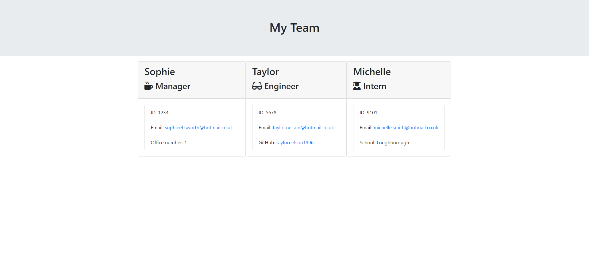

# Sophie-Team-Profile-Generator

## Table of Contents

* [Description](#description)
* [Screenshots](#screenshots)
* [Installation Instructions](#installation-instructions)
* [Usage](#usage)
* [Technologies Used](#technologies-used)
* [Tests](#tests)
* [Credits](#credits)
* [Questions](#questions)

## Description

This is a CLI application using Node.js that generates an team.html file containing names, roles, IDs, email addresses, an office number (for managers), GitHub account link (for engineers), and school (for interns.)


## Screenshots

Generated team page, viewed through the browser:

  
## Installation Instructions

If you want to run a copy of this app on your local machine, first clone the repository:

HTTPS:
```
$ git clone https://github.com/SophieEbby/Sophie-Team-Profile-Generator.git
```

SSH:
```
$ git clone git@github.com:SophieEbby/Sophie-Team-Profile-Generator.git
```

Then cd/ into the cloned directory and download the dependencies into the cloned directory by entering into the command line:
```
$ npm install
```

Once the dependencies are installed, start the application by typing into the command line:
```
$ node index.js
```

## Usage

This project is intended to be used to generate a team-page for a team of developers that includes a manager, any number of engineers, and any number of interns.

## Technologies Used

[](https://nodejs.org/en/) [](https://www.npmjs.com/package/inquirer) [](https://jestjs.io/)

## Tests

npm run test

## Credits

Thank you to my tutor Laura Cole for teaching us the principles to be able to create this project. 

Thank you to the lesson material and videos that I used to develop the project. 

Thank you to ChatGPT for helping me solve code issues.

## Questions

If you have further questions, you can reach me at sophieebsworth@hotmail.co.uk. For more of my work, see [my GitHub](https://github.com/SophieEbby).

